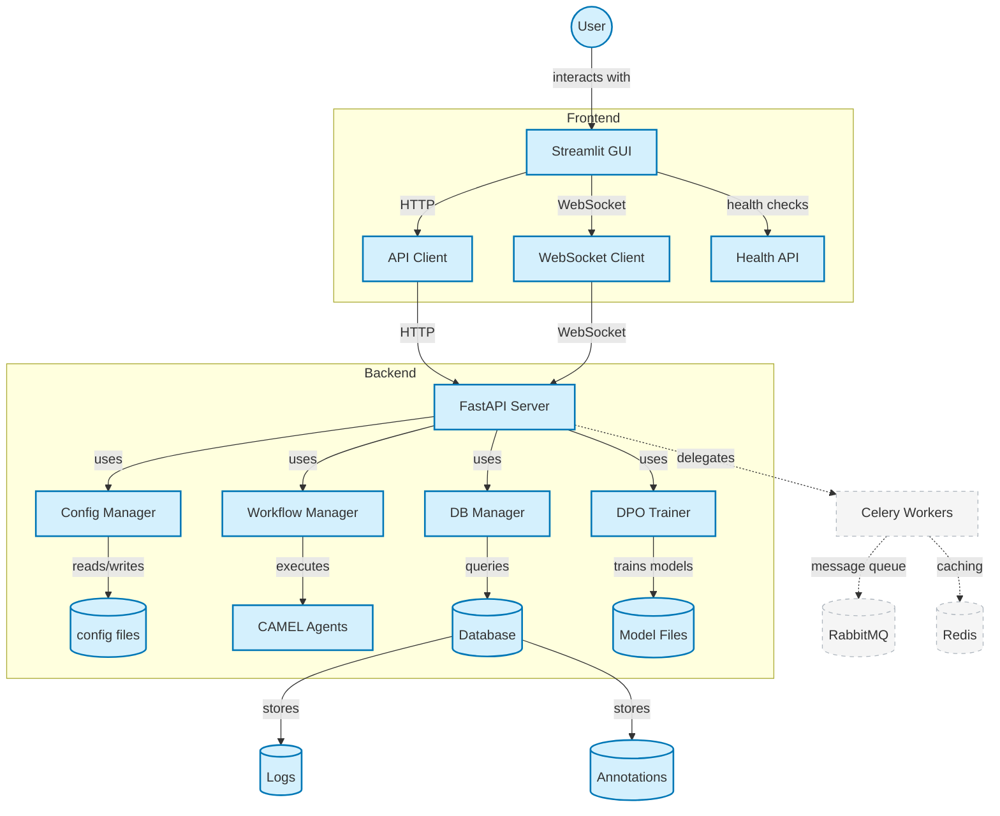
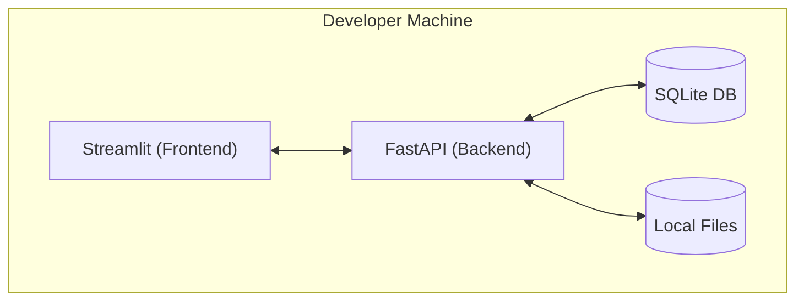
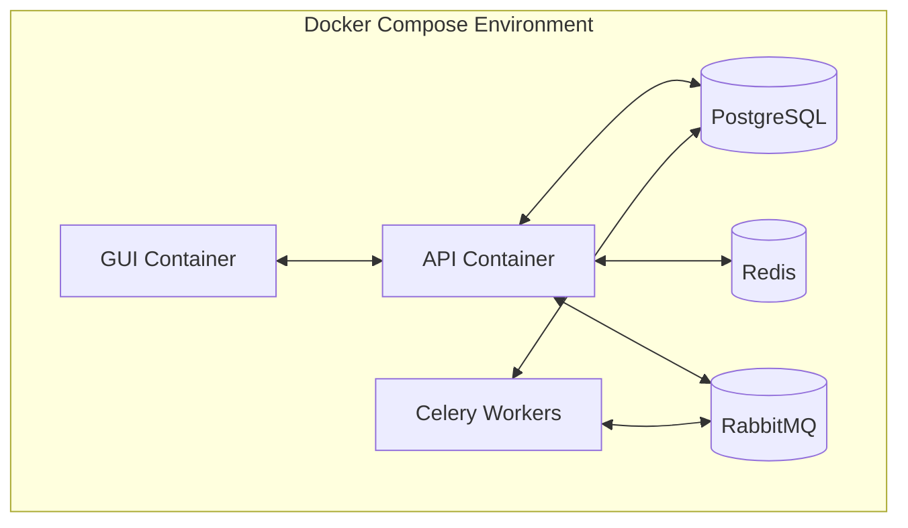

# CAMEL Extensions Architecture

This document outlines the architecture of the CAMEL Extensions project, including the relationships between components, data flow, and deployment structure.

## System Overview

The CAMEL Extensions system is built with a modern architecture that separates the frontend UI from the backend API, with real-time communication channels and persistent storage.

## Component Description

### Frontend

- **Streamlit GUI**: User interface built with Python's Streamlit framework
- **API Client**: HTTP client for communicating with the backend API
- **WebSocket Client**: Client for real-time data from the backend
- **Health API**: FastAPI sidecar for health checks and monitoring

### Backend

- **FastAPI Server**: Main backend API server exposing RESTful endpoints and WebSocket connections
- **Config Manager**: Service for handling configuration files and settings
- **Workflow Manager**: Service for executing and controlling CAMEL agent workflows
- **DB Manager**: Service for database operations and queries
- **DPO Trainer**: Service for managing DPO (Direct Preference Optimization) training runs

### Storage

- **Database**: SQL database for storing logs, annotations, and other structured data
- **Config Files**: YAML files for configuring agents and workflows
- **Model Files**: Storage for model weights, adapters, and fine-tuning artifacts

### Future Components (Planned)

- **Celery Workers**: Distributed task queue for background processing
- **RabbitMQ**: Message broker for reliable task distribution
- **Redis**: Cache for session state and frequent queries

## Data Flow

1. User interacts with the Streamlit GUI
2. GUI sends requests to the backend API via the API Client
3. For real-time updates, the GUI connects to the backend via WebSockets
4. The backend API processes requests through appropriate services:
   - Config Manager for configuration operations
   - Workflow Manager for workflow execution
   - DB Manager for database operations
   - DPO Trainer for training jobs
5. Services interact with storage components as needed
6. Results are returned to the GUI for display

## Deployment Architecture

The system can be deployed in two main configurations:

### Development/Local Deployment

### Production Deployment (Docker-based)

## Security Architecture

The system employs these security measures:

1. API endpoints protected with JWT-based authentication (planned)
2. Input validation and sanitization on all endpoints
3. HTTPS for all external communications
4. Environment variable-based configuration for sensitive values
5. Role-based access control for user operations (planned)

## Future Architecture Evolution

As the system matures according to the [project roadmap](../ROADMAP.md), the architecture will evolve to:

1. Replace direct service calls with message-based communication
2. Add horizontal scaling capability for all components
3. Implement circuit breakers and bulkheads for resilience
4. Support multi-tenant deployment with proper isolation